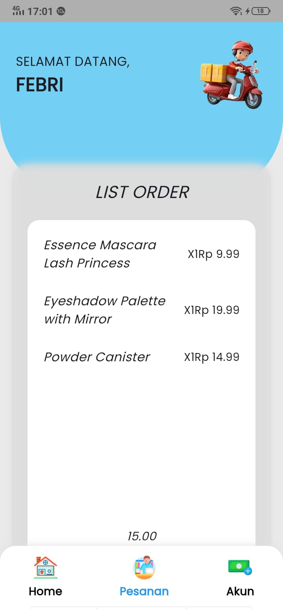
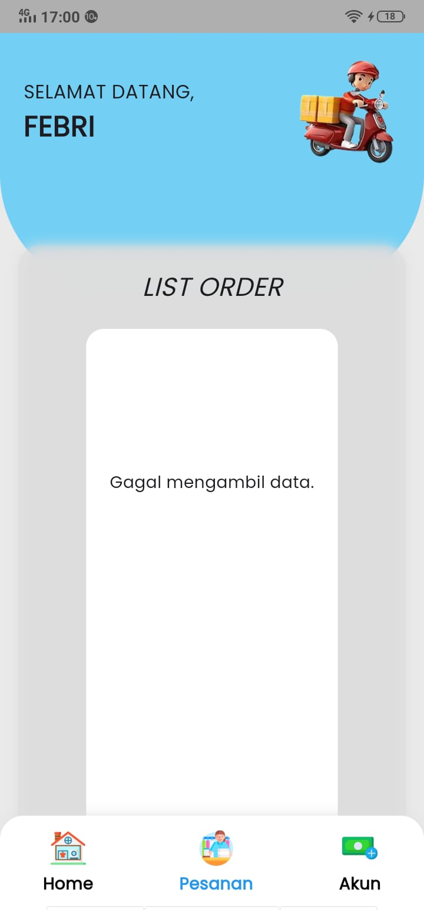
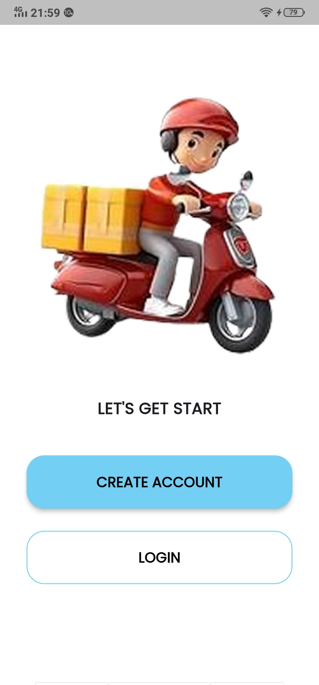
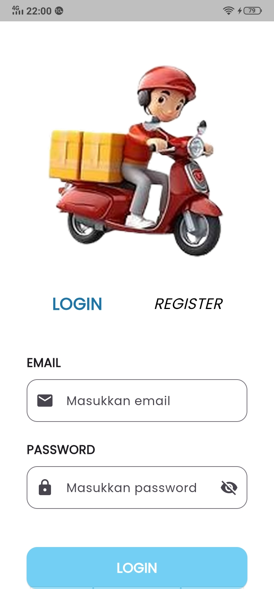
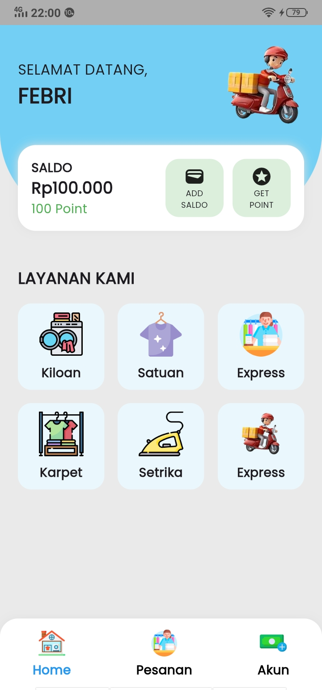
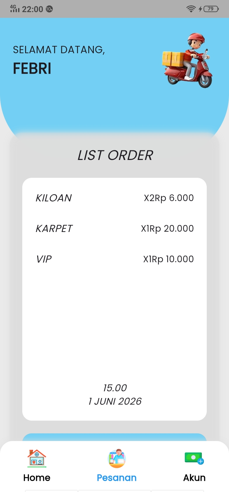
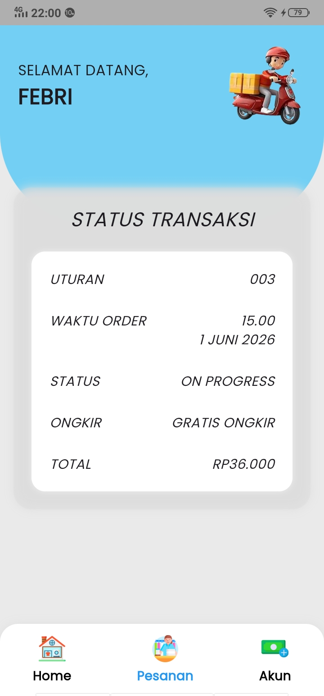
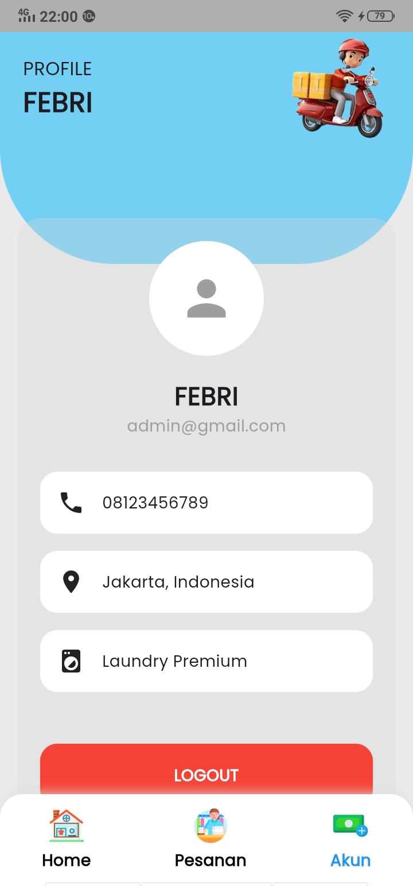
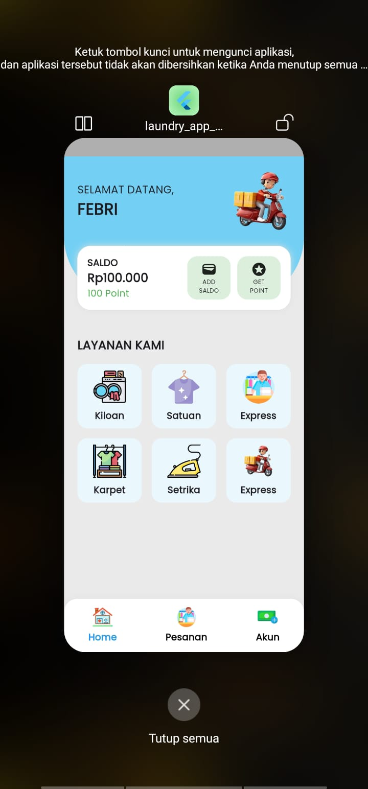
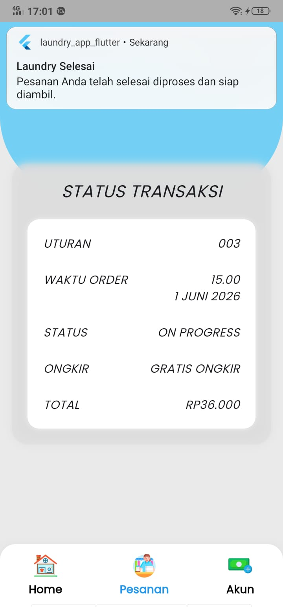

# Laundry App Flutter

Aplikasi **Laundry App Flutter** merupakan pengembangan dari tugas **Ujian Tengah Semester (UTS)** pada mata kuliah **Mobile Computing**. Pada tahap **Ujian Akhir Semester (UAS)**, aplikasi dikembangkan menjadi lebih fungsional dengan menerapkan **Software Architecture (MVC)**, **State Management (Provider)**, **REST API**, **Local Storage (Shared Preferences)**, serta **Mobile Feature (Local Notification)** sesuai dengan ketentuan tugas UAS.

---

# Deskripsi Aplikasi

Laundry App Flutter merupakan aplikasi mobile sederhana yang digunakan untuk mensimulasikan proses pemesanan layanan laundry. Aplikasi dibangun menggunakan **Flutter** berdasarkan desain UI/UX dari **Figma**.

Pada tahap UAS, aplikasi telah dikembangkan dengan menerapkan konsep Mobile Computing, meliputi:

- Software Architecture (MVC)
- State Management (Provider)
- REST API Integration
- Local Storage (Shared Preferences)
- Local Notification

---

# Fitur Aplikasi

- Splash Screen
- Get Started
- Login Authentication
- Home Page
- List Order
- Status Transaksi
- Account Page
- Logout
- REST API Integration
- Shared Preferences
- Local Notification

---

# Software Architecture

Project menerapkan arsitektur **MVC (Model - View - Controller)** sehingga setiap komponen memiliki tanggung jawab yang jelas (Separation of Concerns).

## Struktur Project

```text
lib/
│
├── constants/
├── controllers/
├── models/
├── providers/
├── services/
├── storage/
├── views/
├── widgets/
└── main.dart
```

---

# State Management

Aplikasi menggunakan **Provider** sebagai State Management.

Provider yang digunakan:

### AuthProvider

Mengelola:

- Login
- Logout
- Status Login
- Loading Authentication

### OrderProvider

Mengelola:

- Pengambilan data REST API
- Loading State
- Error State
- Update UI menggunakan notifyListeners()

---

# REST API Integration

Aplikasi mengimplementasikan REST API menggunakan package **HTTP** untuk mengambil data produk pada halaman **List Order**.

Endpoint yang digunakan:

```text
https://dummyjson.com/products
```

Data yang ditampilkan meliputi:

- Nama Produk
- Harga
- Thumbnail Produk

REST API juga telah menerapkan penanganan kondisi berhasil maupun gagal.

### REST API Berhasil

Data berhasil diambil dari server dan ditampilkan pada halaman **List Order**.



---

### REST API Gagal

Apabila perangkat tidak memiliki koneksi internet atau server tidak dapat diakses, aplikasi akan menampilkan pesan kesalahan kepada pengguna.



---

# Local Storage

Project menggunakan **Shared Preferences**.

Digunakan untuk:

- Menyimpan status login pengguna.
- Mengecek status login saat aplikasi dibuka kembali.
- Menghapus status login ketika logout.

Flow Login

```text
Login
   │
   ▼
Shared Preferences
   │
   ▼
Splash Screen
   │
   ├── Login = true
   │       │
   │       ▼
   │     Home
   │
   └── Login = false
           │
           ▼
        Login
```

---

# Mobile Feature

Project mengimplementasikan **Local Notification**.

Notification akan muncul ketika pengguna membuka halaman **Status Transaksi** sebagai simulasi bahwa pesanan laundry telah selesai diproses.

Judul Notification

```text
Laundry Selesai
```

Isi Notification

```text
Pesanan Anda telah selesai diproses dan siap diambil.
```

---

# UX Principles

Aplikasi menerapkan prinsip dasar UI/UX sebagai berikut:

### Consistency

- Warna konsisten.
- Typography konsisten.
- Navigasi konsisten.

### Visibility

- Informasi transaksi mudah dibaca.
- Tombol mudah dikenali.

### Feedback

- Validasi Login.
- Loading REST API.
- Error Message REST API.
- Snackbar.
- Local Notification.

### Simplicity

Navigasi sederhana sehingga mudah digunakan oleh pengguna.

---

# Dummy Login

Email

```text
admin@gmail.com
```

Password

```text
123456
```

---

# Tech Stack

- Flutter
- Dart
- Provider
- HTTP
- Shared Preferences
- Flutter Local Notifications

---

# Cara Menjalankan Project

## Clone Repository

```bash
git clone <repository-url>
```

## Install Dependency

```bash
flutter pub get
```

## Jalankan Project

```bash
flutter run
```

---

# Link Desain Figma

https://www.figma.com/design/5XznrYfvZtZvUM6msrNG1E/LAUNDRY?node-id=0-1&p=f&t=wsTtz3Dt61FslEqP-0

---

# Screenshot Implementasi

## Splash Screen


---

## Get Started



---

## Login



---

## Home



---

## List Order



---

## Status Transaksi



---

## Account



---

## Shared Preferences

Status login berhasil disimpan menggunakan **Shared Preferences** sehingga pengguna tidak perlu login kembali ketika aplikasi dibuka ulang.



---

## Local Notification

Implementasi **Local Notification** ketika status laundry selesai diproses.



---

# Hasil Implementasi UAS

| Requirement UAS | Status |
|-----------------|:------:|
| Desain UI/UX | ✅ |
| Implementasi Flutter | ✅ |
| Software Architecture (MVC) | ✅ |
| State Management (Provider) | ✅ |
| REST API Integration | ✅ |
| Local Storage (Shared Preferences) | ✅ |
| Mobile Feature (Local Notification) | ✅ |
| Repository GitHub | ✅ |
| Dokumentasi README | ✅ |
| Screenshot Implementasi | ✅ |

---

# Author

**Nama Mahasiswa**

Mata Kuliah : **Mobile Computing**

Universitas : **(Sesuaikan dengan identitas mahasiswa)**

---

# Lisensi

Project ini dibuat untuk memenuhi tugas **Ujian Akhir Semester (UAS)** Mata Kuliah **Mobile Computing**.
